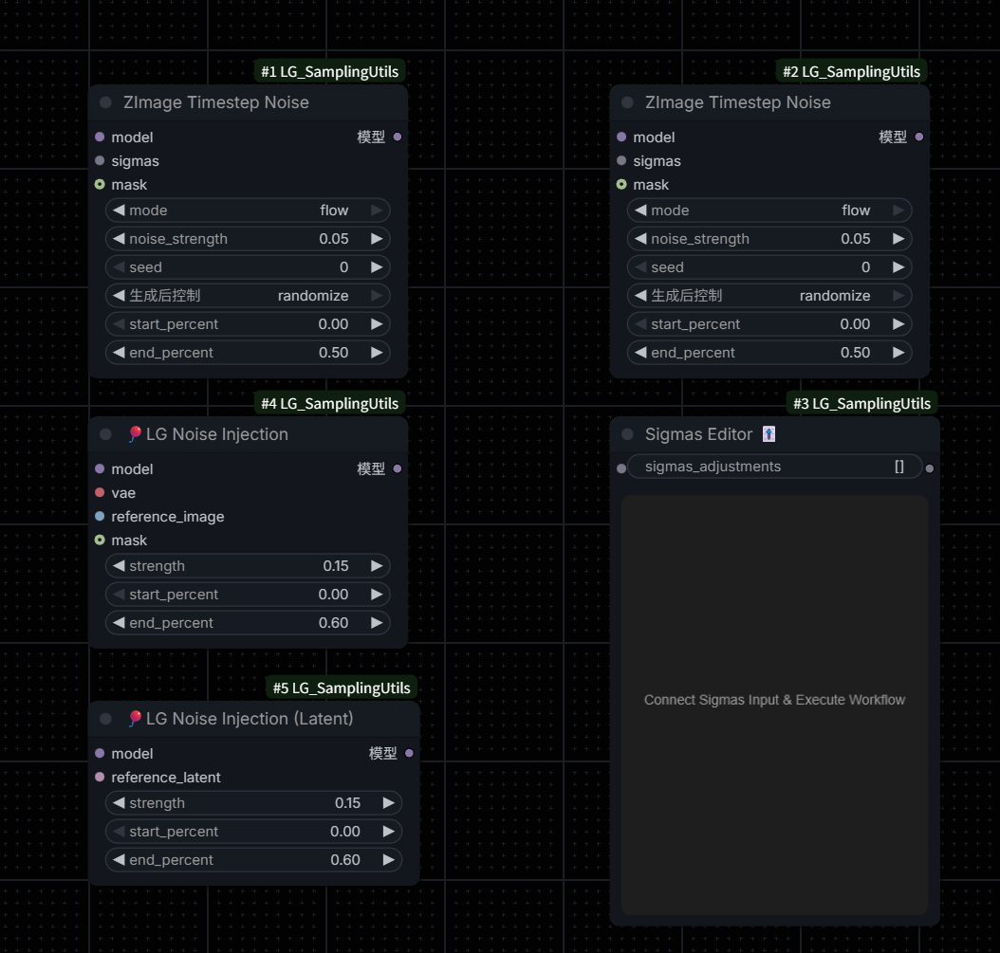

# ComfyUI-LG_SamplingUtils



[中文文档](README_CN.md) | **English**

---

## Overview

**ComfyUI-LG_SamplingUtils** is a comprehensive toolset designed for ComfyUI by LAOGOU-666, providing a series of practical sampling nodes that make operations more intuitive and convenient. This extension focuses on advanced sampling techniques, particularly optimized for Flow Matching models like ZImage and Lumina2.

## Features

This extension includes four powerful nodes:

### 1. 🎈 ZImage Timestep Noise

Adds noise perturbation to timesteps during the sampling process to break model homogenization and produce more diverse outputs with different seeds.

**Key Features:**
- Two modes: `sigma` (traditional diffusion models) and `flow` (Flow Matching models)
- Adjustable noise strength and application range
- Optional mask support for localized effects
- Seed-based reproducibility

**Parameters:**
- `mode`: Choose between `sigma` (multiplicative noise) or `flow` (additive noise)
- `noise_strength`: Control the intensity of noise (0.0-2.0)
- `seed`: Random seed for reproducibility
- `start_percent` / `end_percent`: Define the sampling range where noise is applied
- `mask` (optional): Limit the effect to specific regions

### 2. 🎈 LG Noise Injection

Injects features from a reference image into the generation process through the CFG mechanism, allowing the model to "learn" specific qualities from the reference.

**Key Features:**
- Inject surface details like water droplets, sweat, textures
- Add material properties and reflections
- Mask support for targeted feature injection
- Strength decay over sampling steps

**Parameters:**
- `reference_image`: Image containing desired features
- `strength`: Injection strength (0.1-0.2 subtle, 0.2-0.4 noticeable)
- `start_percent` / `end_percent`: Define when feature injection occurs
- `mask` (optional): White areas receive feature injection

**Variant:** 🎈 **LG Noise Injection (Latent)** - Works directly with latent representations and automatically uses `noise_mask` if present in the latent.

### 3. Model Sampling ZImage

Adjusts sampling parameters for ZImage/Lumina2 models.

**Key Features:**
- Proper timestep scaling for Flow Matching models
- Adjustable noise schedule shift
- Compatible with ZImage, Lumina2, and AuraFlow

**Parameters:**
- `shift`: Noise schedule shift (default 3.0 for ZImage)
  - `shift=1.0`: Linear schedule
  - `shift>1.0`: Shifts toward high noise, more aggressive early steps
- `multiplier`: Timestep multiplier (1.0 for ZImage/AuraFlow, 1000 for SD3/Flux)

### 4. Sigmas Editor 🎚️

Interactive visual editor for adjusting the sigmas curve in real-time.

**Key Features:**
- Drag-and-drop curve editing
- Real-time visualization
- Fine-tune noise schedules for optimal results

## Examples

<div align="center">


</div>

## Installation

### Method 1: ComfyUI Manager (Recommended)

1. Open ComfyUI Manager
2. Search for "ComfyUI-LG_SamplingUtils"
3. Click Install

### Method 2: Manual Installation

```bash
cd ComfyUI/custom_nodes
git clone https://github.com/LAOGOU-666/ComfyUI-LG_SamplingUtils.git
```

Restart ComfyUI after installation.

## Contact

- **WeChat**: wenrulaogou2033
- **Bilibili**: [老狗_学习笔记](https://space.bilibili.com/175873218?spm_id_from=333.788.0.0)

## Repository

[https://github.com/LAOGOU-666/ComfyUI-LG_SamplingUtils](https://github.com/LAOGOU-666/ComfyUI-LG_SamplingUtils)

## Support

If you encounter any issues or have suggestions, please open an issue on GitHub.

## Changelog

### v1.0.0
- Initial release
- Added ZImage Timestep Noise node
- Added LG Noise Injection nodes (Image and Latent variants)
- Added Model Sampling ZImage node
- Added Sigmas Editor node

---

**Enjoy creating with ComfyUI-LG_SamplingUtils! 🎈**
