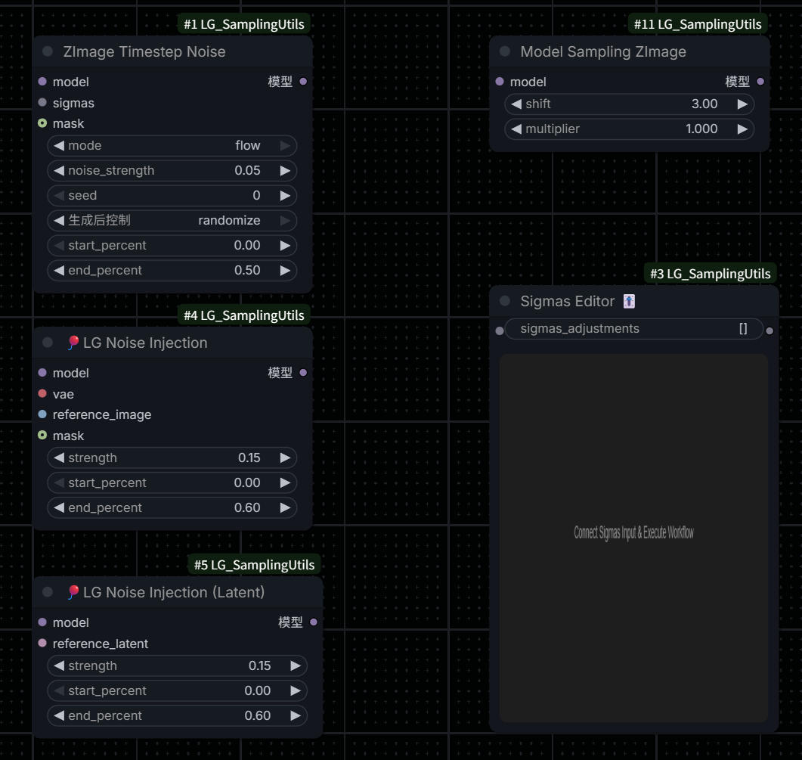
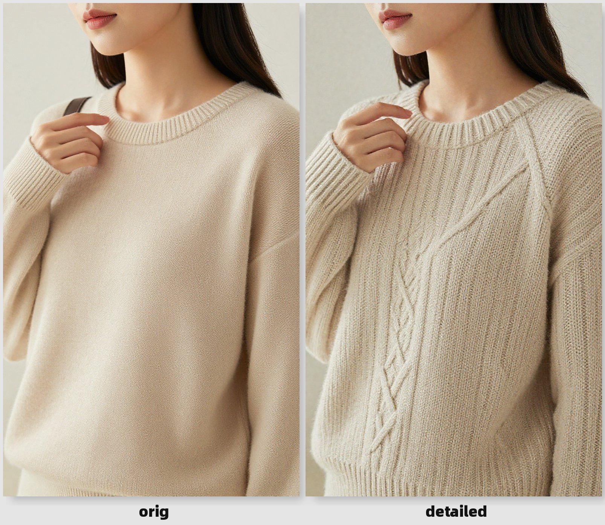
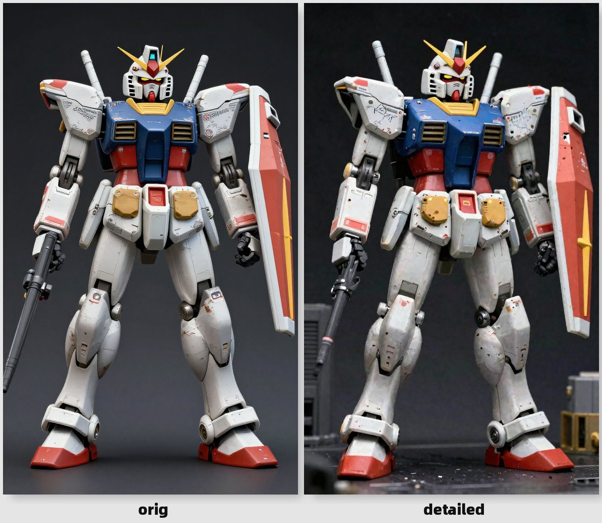
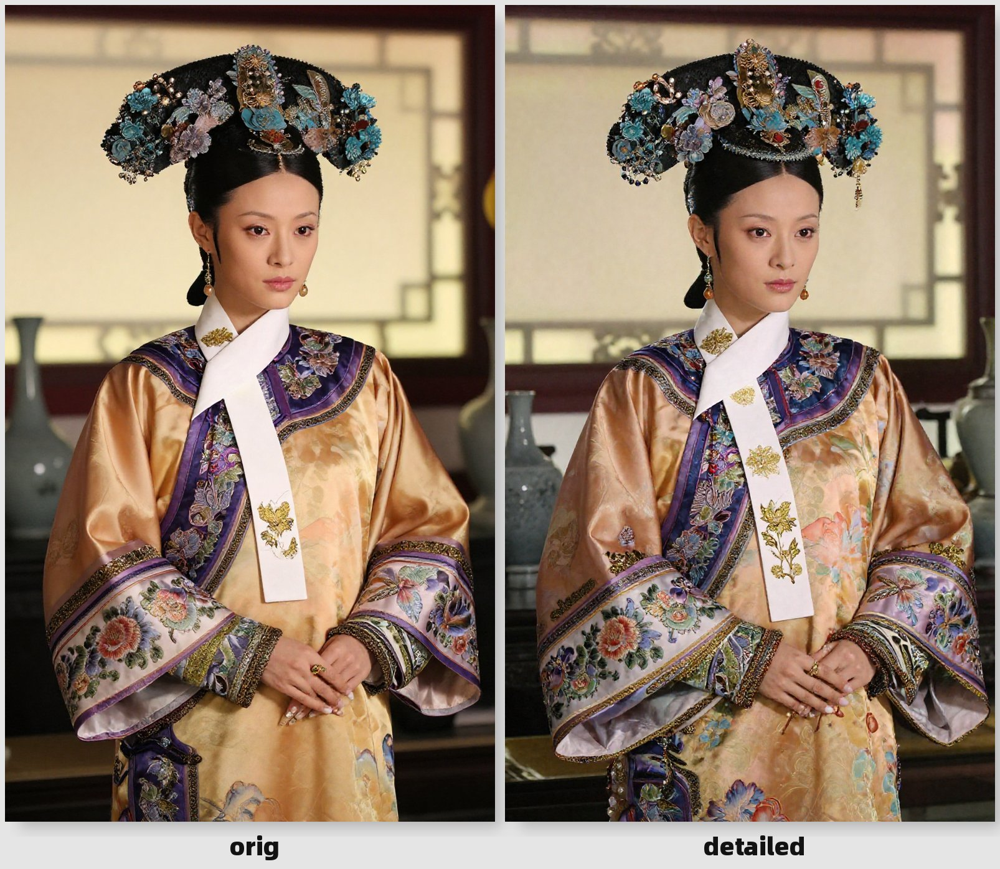
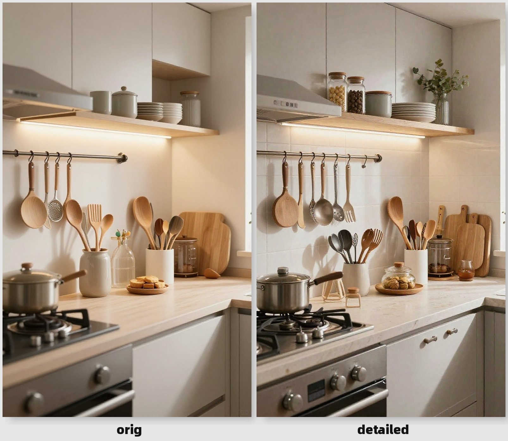
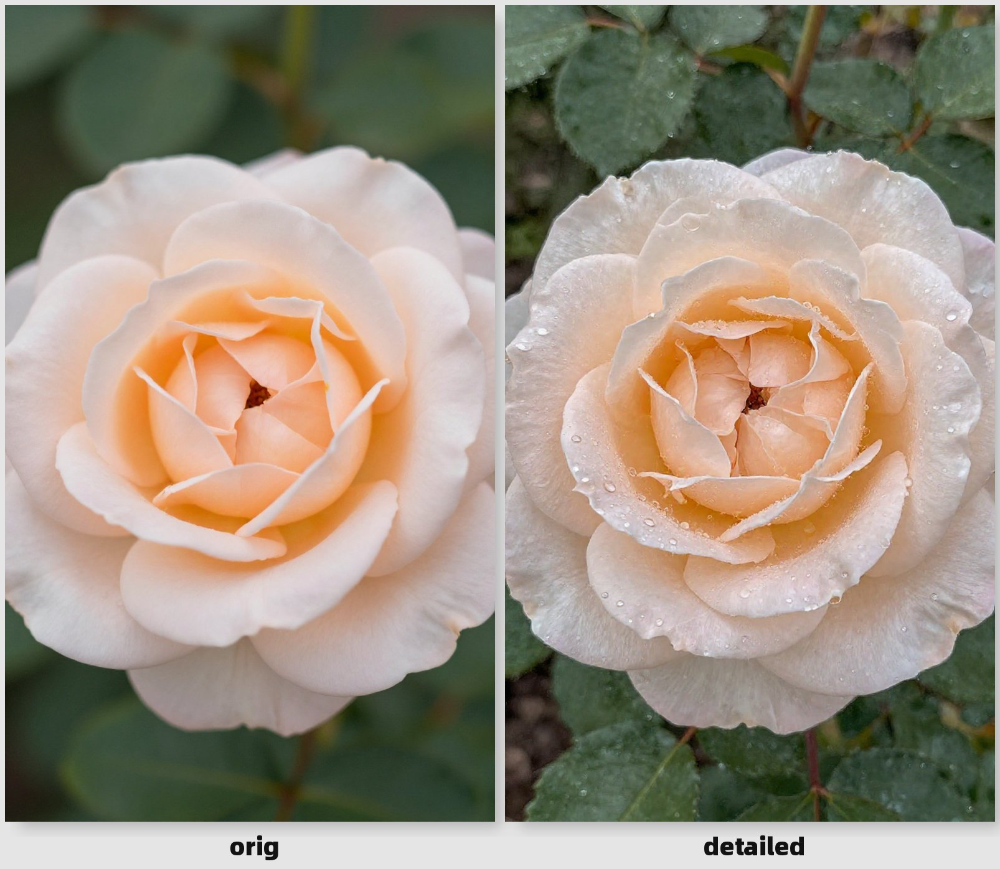
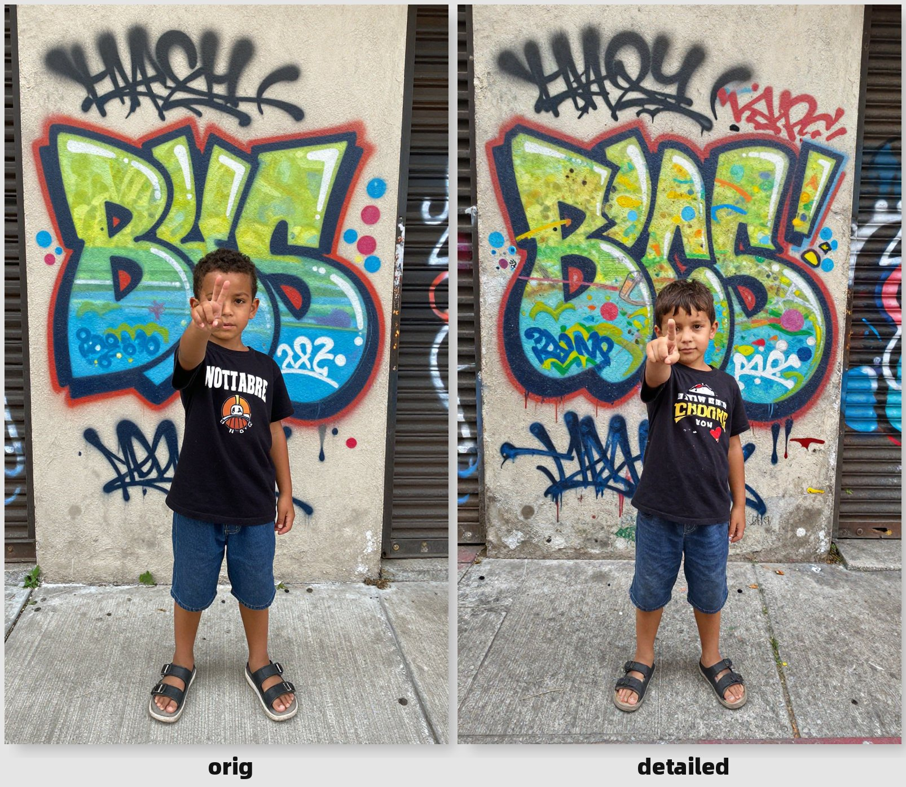
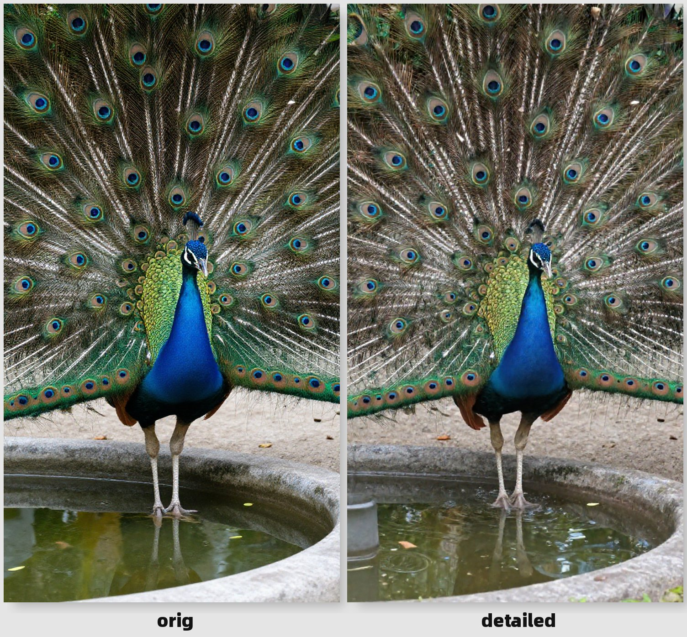
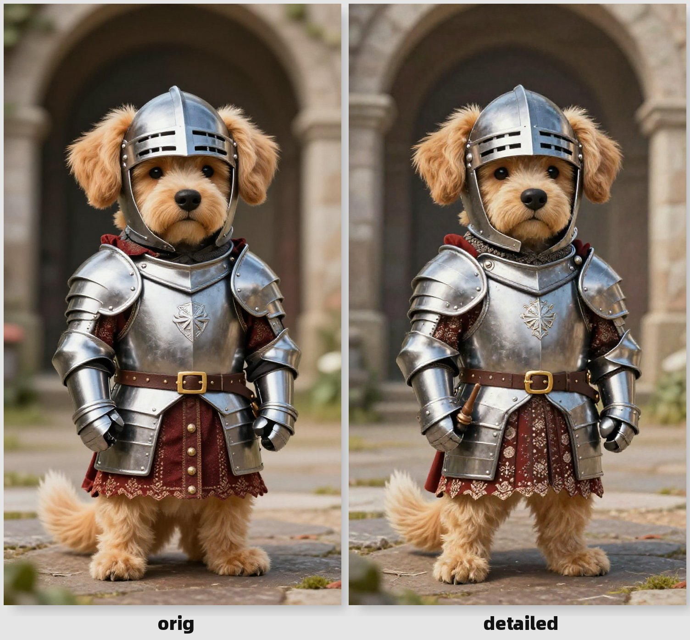

# ComfyUI-LG_SamplingUtils



**中文** | [English](README.md)

---

## 概述

**ComfyUI-LG_SamplingUtils** 是由 LAOGOU-666 为 ComfyUI 设计的综合工具集，提供一系列实用的采样节点，使操作更加直观和便捷。本扩展专注于高级采样技术，特别针对 ZImage 和 Lumina2 等 Flow Matching 模型进行了优化。

## 功能特性

本扩展包含四个强大的节点：

### 1. 🎈 ZImage Timestep Noise（时间步噪声）

在采样过程中对时间步添加噪声扰动，打破模型的同质化输出，使不同种子能产生更明显的差异。

**核心功能：**
- 两种模式：`sigma`（传统扩散模型）和 `flow`（Flow Matching 模型）
- 可调节的噪声强度和应用范围
- 可选的遮罩支持，实现局部效果
- 基于种子的可重现性

**参数说明：**
- `mode`：选择 `sigma`（乘性噪声）或 `flow`（加性噪声）
- `noise_strength`：控制噪声强度（0.0-2.0）
- `seed`：随机种子，确保可重现
- `start_percent` / `end_percent`：定义噪声应用的采样范围
- `mask`（可选）：限制效果到特定区域

### 2. 🎈 LG Noise Injection（噪声注入）

通过 CFG 机制将参考图像的特征注入到生成过程中，让模型"学习"参考图像的特定品质。

**核心功能：**
- 注入表面细节，如水珠、汗珠、纹理
- 添加材质属性和反射效果
- 支持遮罩进行定向特征注入
- 采样过程中强度逐渐衰减

**参数说明：**
- `reference_image`：包含所需特征的参考图像
- `strength`：注入强度（0.1-0.2 轻微，0.2-0.4 明显）
- `start_percent` / `end_percent`：定义特征注入的时机
- `mask`（可选）：白色区域接收特征注入

**变体：** 🎈 **LG Noise Injection (Latent)** - 直接使用潜在表示工作，如果潜在中存在 `noise_mask` 则自动使用。

### 3. Model Sampling ZImage（ZImage 采样）

调整 ZImage/Lumina2 模型的采样参数。

**核心功能：**
- 为 Flow Matching 模型提供正确的时间步缩放
- 可调节的噪声调度偏移
- 兼容 ZImage、Lumina2 和 AuraFlow

**参数说明：**
- `shift`：噪声调度偏移（ZImage 默认 3.0）
  - `shift=1.0`：线性调度
  - `shift>1.0`：向高噪声偏移，早期步骤更激进
- `multiplier`：时间步乘数（ZImage/AuraFlow 为 1.0，SD3/Flux 为 1000）

### 4. Sigmas Editor 🎚️（Sigmas 编辑器）

交互式可视化编辑器，实时调整 sigmas 曲线。

**核心功能：**
- 拖放式曲线编辑
- 实时可视化
- 微调噪声调度以获得最佳结果

## 示例展示

<div align="center">










</div>

## 安装方法

### 方法 1：ComfyUI Manager（推荐）

1. 打开 ComfyUI Manager
2. 搜索 "ComfyUI-LG_SamplingUtils"
3. 点击安装

### 方法 2：手动安装

```bash
cd ComfyUI/custom_nodes
git clone https://github.com/LAOGOU-666/ComfyUI-LG_SamplingUtils.git
```

安装后重启 ComfyUI。

## 联系方式

- **微信**: wenrulaogou2033
- **Bilibili**: [老狗_学习笔记](https://space.bilibili.com/175873218?spm_id_from=333.788.0.0)

## 仓库地址

[https://github.com/LAOGOU-666/ComfyUI-LG_SamplingUtils](https://github.com/LAOGOU-666/ComfyUI-LG_SamplingUtils)

## 支持

如果您遇到任何问题或有建议，请在 GitHub 上提交 issue。

## 更新日志

### v1.0.0
- 首次发布
- 添加 ZImage Timestep Noise 节点
- 添加 LG Noise Injection 节点（图像和潜在变体）
- 添加 Model Sampling ZImage 节点
- 添加 Sigmas Editor 节点

---

**使用 ComfyUI-LG_SamplingUtils 愉快创作！🎈**

